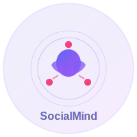

# 🌐 SocialMind - Hybrid Sosyal Medya Yönetim Platformu

<div align="center">



**Tüm sosyal medya hesaplarınızı tek yerden yönetin**

[](https://dotnet.microsoft.com/)
[](https://dotnet.microsoft.com/apps/aspnet/web-apps/blazor)
[](https://dotnet.microsoft.com/apps/maui)
[](LICENSE)

[Özellikler](#-özellikler) •
[Kurulum](#-kurulum) •
[Kullanım](#-kullanım) •
[Mimari](#-mimari) •
[Katkıda Bulunma](#-katkıda-bulunma)

</div>

---

## 📖 Hakkında

SocialMind, **YouTube, TikTok, Instagram, Facebook, Twitter/X ve LinkedIn** gibi tüm popüler sosyal medya platformlarınızı tek bir yerden yönetmenize olanak sağlayan modern, hybrid bir uygulamadır.

### 🎯 Neden SocialMind?

- 🚀 **Tek Platform**: Tüm sosyal medya hesaplarınızı tek yerden kontrol edin
- 🤖 **AI Destekli**: GPT-4o, Gemini, NVIDIA modelleri ile otomatik içerik üretimi
- 📱 **Çoklu Platform**: Web, Windows, iOS, Android ve macOS desteği
- ⏰ **Akıllı Zamanlama**: AI ile optimal paylaşım zamanları
- 📊 **Detaylı Analitik**: Platform bazında performans metrikleri
- 🔒 **Güvenli**: OAuth2 entegrasyonu ve şifreli veri saklama

---

## ✨ Özellikler

### 📱 Desteklenen Platformlar

- ✅ **YouTube** - OAuth ile tam entegrasyon
- ✅ **TikTok** - Video paylaşımı ve analitik
- ✅ **Instagram** - Görsel içerik yönetimi
- ✅ **Facebook** - Sayfa ve grup yönetimi
- ✅ **Twitter/X** - Tweet ve thread oluşturma
- ✅ **LinkedIn** - Profesyonel içerik paylaşımı

### 🤖 AI Model Desteği

#### Ücretli Modeller

- **OpenAI**: GPT-4o, GPT-4o Mini
- **Google Gemini**: 1.5 Pro (2M context), 1.5 Flash
- **NVIDIA**: Llama 3.1 Nemotron 70B, Mistral NeMo 12B

#### ÜCRETSİZ Modeller (GitHub Models)

- GPT-4o & GPT-4o Mini
- Phi-4
- Llama 3.3 70B
- Mistral Large
- Cohere Command R
- AI21 Jamba 1.5 (256K context)

### 📝 İçerik Yönetimi

- ✍️ Çok platformlu gönderi oluşturma
- 👁️ Gerçek zamanlı platform önizlemeleri
- 📏 Akıllı karakter sayacı (platform özel limitler)
- 🖼️ Media yönetimi (resim, video)
- #️⃣ Hashtag ve mention desteği
- 🤖 AI ile otomatik içerik üretimi
- 🌍 Çoklu dil desteği ve çeviri

### ⏰ Zamanlama & Otomasyonu

- 📅 Belirli zaman planlaması
- 🔄 Tekrarlayan gönderiler
- 🎯 AI destekli optimal zamanlama önerileri
- 📆 Takvim görünümü
- ⚡ Otomatik post yayını
- 🕒 Saat dilimi desteği

### 📊 Analitik & Raporlama

- 📈 Platform bazında performans metrikleri
- 💬 Post analitiği (likes, comments, shares, impressions)
- ⏰ En iyi performans zamanları analizi
- #️⃣ Hashtag performans takibi
- 💰 Kampanya ROI izleme
- 📊 Özelleştirilebilir raporlar
- 📤 Excel/PDF export

---

## 🏗️ Mimari

### Tech Stack

```
┌─────────────────────────────────────────────────┐
│              SocialMind Ecosystem                │
├─────────────────────────────────────────────────┤
│  Web App        │  Blazor Server (.NET 10)      │
│  Mobile App     │  .NET MAUI (iOS, Android)     │
│  Desktop App    │  .NET MAUI (Windows, macOS)   │
├─────────────────────────────────────────────────┤
│  Shared Layer   │  Razor Components & Models    │
│  Services       │  AI, Platform, Analytics      │
│  Database       │  SQL Server + EF Core 10      │
├─────────────────────────────────────────────────┤
│  AI Providers   │  OpenAI, Gemini, NVIDIA       │
│  Social APIs    │  OAuth2 + Platform APIs       │
└─────────────────────────────────────────────────┘
```

### Proje Yapısı

```
SocialMind/
├── 📁 SocialMind/              # MAUI Multi-Platform App
│   ├── Platforms/              # Platform-specific code
│   │   ├── Android/
│   │   ├── iOS/
│   │   ├── Windows/
│   │   └── MacCatalyst/
│   └── Resources/              # App resources
│
├── 📁 SocialMind.Web/          # ASP.NET Core Web App
│   ├── Components/
│   ├── Pages/
│   └── wwwroot/
│       └── assets/             # Logos, icons, images
│
└── 📁 SocialMind.Shared/       # Shared Components & Logic
    ├── Models/                 # Data models
    │   ├── AIModels.cs
    │   ├── PlatformModels.cs
    │   ├── PostModels.cs
    │   ├── AnalyticsModels.cs
    │   └── ScheduleModels.cs
    ├── Services/               # Service interfaces
    └── Components/             # Shared Razor components
```

---

## 🚀 Kurulum

### Gereksinimler

- ✅ [.NET 10 SDK](https://dotnet.microsoft.com/download/dotnet/10.0) (10.0.102+)
- ✅ [Visual Studio 2025](https://visualstudio.microsoft.com/) veya [VS Code](https://code.visualstudio.com/)
- ✅ [SQL Server](https://www.microsoft.com/sql-server) (LocalDB yeterli)
- ⚙️ [Docker Desktop](https://www.docker.com/products/docker-desktop) (Opsiyonel)
- 📱 Mobile development için: iOS/Android SDK'ları

### MAUI Workload Kurulumu

```bash
# .NET MAUI workload'ını yükle
dotnet workload install maui

# Tüm workload'ları listele
dotnet workload list
```

### Projeyi Klonlama

```bash
git clone https://github.com/ultrarslanoglu/SocialMind.git
cd SocialMind
```

### Bağımlılıkları Yükleme

```bash
# NuGet paketlerini restore et
dotnet restore

# Tüm projeleri derle
dotnet build
```

### Veritabanı Kurulumu

```bash
# Migration'ları uygula (yakında eklenecek)
cd SocialMind.Web
dotnet ef database update
```

---

## 💻 Kullanım

### Web Uygulamasını Çalıştırma

```bash
cd SocialMind/SocialMind.Web
dotnet run

# Tarayıcıda aç: https://localhost:7259
```

### Windows Desktop Uygulaması

```bash
cd SocialMind/SocialMind
dotnet run -f net10.0-windows10.0.19041.0
```

### Android Emulator

```bash
# Android emulator başlat
cd SocialMind/SocialMind
dotnet build -f net10.0-android
dotnet run -f net10.0-android
```

### iOS Simulator (Mac gerekli)

```bash
cd SocialMind/SocialMind
dotnet build -f net10.0-ios
dotnet run -f net10.0-ios
```

---

## 🔧 Yapılandırma

### API Anahtarları

`appsettings.json` dosyasını düzenleyin:

```json
{
  "AIProviders": {
    "OpenAI": {
      "ApiKey": "your-openai-api-key"
    },
    "GoogleGemini": {
      "ApiKey": "your-gemini-api-key"
    },
    "NVIDIA": {
      "ApiKey": "your-nvidia-api-key"
    }
  },
  "ConnectionStrings": {
    "DefaultConnection": "Server=(localdb)\\mssqllocaldb;Database=SocialMindDB;Trusted_Connection=True;"
  }
}
```

### OAuth Konfigürasyonu

Her platform için OAuth credentials:

- YouTube: [Google Cloud Console](https://console.cloud.google.com/)
- TikTok: [TikTok for Developers](https://developers.tiktok.com/)
- Instagram: [Meta for Developers](https://developers.facebook.com/)
- Twitter/X: [Twitter Developer Portal](https://developer.twitter.com/)
- LinkedIn: [LinkedIn Developers](https://www.linkedin.com/developers/)

---

## 🐳 Docker ile Çalıştırma

```bash
# Docker container'ı başlat
docker-compose up -d

# Logları takip et
docker-compose logs -f

# Durdur
docker-compose down
```

---

## 🧪 Test

```bash
# Tüm testleri çalıştır
dotnet test

# Belirli bir test projesini çalıştır
dotnet test SocialMind.Tests
```

---

## 📊 Performans

- ⚡ **Sayfa Yükleme**: < 1 saniye
- 🚀 **API Response**: < 200ms
- 💾 **Memory Usage**: ~150MB (Web)
- 📱 **App Size**: ~25MB (MAUI)

---

## 🗺️ Roadmap

### v1.0 (Q1 2026)

- [x] Proje yapısı
- [x] Model tanımlamaları
- [ ] Service implementasyonları
- [ ] Temel CRUD işlemleri
- [ ] OAuth entegrasyonları

### v1.1 (Q2 2026)

- [ ] AI içerik üretimi
- [ ] Zamanlama sistemi
- [ ] Analytics dashboard
- [ ] Mobile app optimization

### v2.0 (Q3 2026)

- [ ] Team collaboration
- [ ] Advanced analytics
- [ ] Campaign management
- [ ] API for third-party integrations

---

## 🤝 Katkıda Bulunma

Katkılarınızı bekliyoruz! Lütfen şu adımları izleyin:

1. Fork yapın
2. Feature branch oluşturun (`git checkout -b feature/AmazingFeature`)
3. Değişikliklerinizi commit edin (`git commit -m 'Add some AmazingFeature'`)
4. Branch'inizi push edin (`git push origin feature/AmazingFeature`)
5. Pull Request açın

Detaylar için [CONTRIBUTING.md](CONTRIBUTING.md) dosyasına bakın.

---

## 📝 Lisans

Bu proje MIT lisansı altında lisanslanmıştır. Detaylar için [LICENSE](LICENSE) dosyasına bakın.

---

## 👥 Geliştirici

**ultrarslanoglu**

- GitHub: [@ultrarslanoglu](https://github.com/ultrarslanoglu)

---

## 🙏 Teşekkürler

- [.NET Team](https://github.com/dotnet) - Harika framework için
- [Blazor Community](https://github.com/AdrienTorris/awesome-blazor) - İlham için
- [OpenAI](https://openai.com/) - AI modelleri için
- Tüm katkıda bulunanlara ❤️

---

## 📞 İletişim

Sorularınız veya önerileriniz için:

- 🐛 Issue açın: [GitHub Issues](https://github.com/ultrarslanoglu/SocialMind/issues)
- 💬 Discussion: [GitHub Discussions](https://github.com/ultrarslanoglu/SocialMind/discussions)

---

<div align="center">

**⭐ Bu projeyi beğendiyseniz yıldız vermeyi unutmayın!**

Made with ❤️ using .NET 10 & Blazor

</div>
